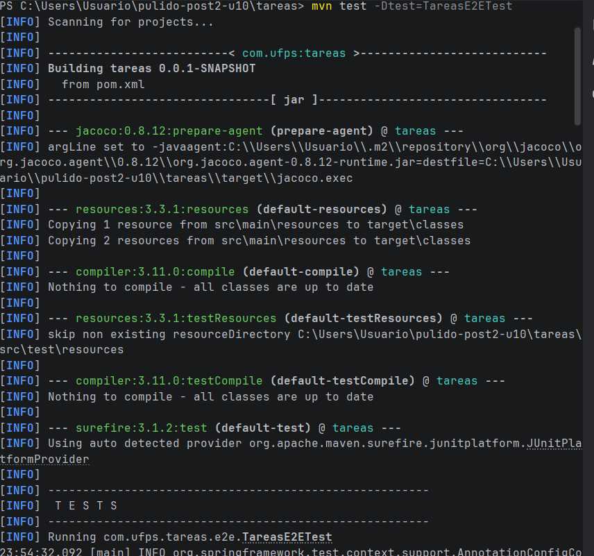
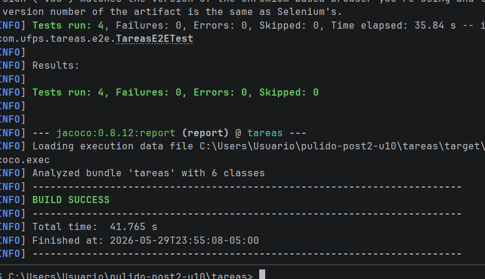

# pulido-post2-u10 — Pruebas E2E con Selenium, Postman y Newman

## Prerrequisitos

- Java 23
- Maven 3.8.x o superior
- Google Chrome (versión estable instalada)
- Node.js 18+ con npm
- Newman instalado globalmente:

```bash
npm install -g newman
```

## Estructura del proyecto

pulido-post2-u10/
│   src/
├── main/
│   └── java/com/ufps/tareas/
│       ├── TareasApplication.java
│       ├── controller/TareaController.java
│       ├── entity/Tarea.java
│       ├── exception/GlobalExceptionHandler.java
│       ├── repository/TareaRepository.java
│       └── service/TareaService.java
└── test/
    └── java/com/ufps/tareas/
        ├── TareasApplicationTests.java
        ├── controller/TareaControllerTest.java
        ├── repository/TareaRepositoryTest.java
        └── service/TareaServiceTest.java
└── README.md

## Checkpoint 1 — Pruebas E2E con Selenium

### Descripción
Las pruebas utilizan el patrón Page Object Model con Selenium WebDriver en modo headless. `TareasPage` encapsula los selectores y acciones sobre la lista de tareas. `NuevaTareaPage` encapsula el formulario de creación.

### Tests implementados
- `paginaTareas_tituloContieneTareas` — verifica que el título del navegador contiene "Tareas"
- `paginaTareas_encabezadoVisible` — verifica que el encabezado h1 muestra "Gestión de Tareas"
- `btnNueva_navegaAFormulario` — verifica que el botón "Nueva Tarea" navega al formulario
- `crearTarea_aparaceEnLista` — verifica que al crear una tarea aparece en la lista

### Ejecución

```bash
# La app NO necesita estar corriendo, el test la levanta solo con puerto aleatorio
mvn test -Dtest=TareasE2ETest
```

### Evidencia Checkpoint 1



---